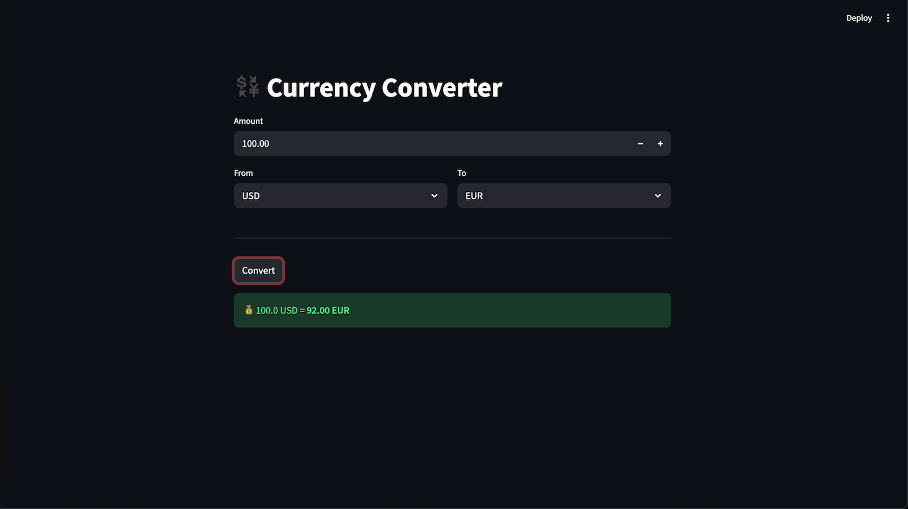

# Currency Converter App

> Your first "vibe coding" experience: Build a real app without writing code yourself.



## Overview

Congratulations! You've just installed Claude Code. Now what?

In this exercise, you'll build a fully functional currency converter app — yes, a real app with a user interface that runs in your browser. And here's the exciting part: **you don't need to know how to code**.

But wait, this isn't magic. The quality of what AI builds for you depends entirely on **how you communicate with it**. This is the most important lesson you'll learn today.

Think of AI like a super-talented intern who just joined your team. They can do amazing work, but only if you give them clear instructions. Say "make me something cool" and you'll get... something. Say "here's exactly what I need, with all the details" and you'll get exactly what you envisioned.

## Learning Objectives

By the end of this exercise, you will:

1. **Experience the power of "vibe coding"** — building apps by describing what you want
2. **Understand why clear requirements matter** — through a hands-on comparison experiment
3. **Learn a practical technique** — how to let AI help you clarify your own ideas when you're not sure what you want

> **Note:** This exercise is NOT about learning Python or Streamlit. It's about learning how to work effectively with AI tools.

## Prerequisites

- Claude Code installed and working (you should be able to run `claude` in your terminal)
- Basic familiarity with using the terminal (cd, ls, etc.)
- That's it! No programming experience required.

## What You'll Build

A simple but functional currency converter that:
- Lets you enter an amount (like 100)
- Select a source currency (like USD)
- Select a target currency (like EUR)
- Shows you the converted result instantly

It's a small app, but it's a **real app** — the kind of thing that would take a beginner programmer hours or days to figure out. You'll have it running in minutes.

---

## Exercises

### Exercise 1: The "One-Liner" Approach

**Goal:** See what happens when you give AI a vague request.

**What to do:**

1. Open your terminal and navigate to this project folder
2. Start Claude Code by typing `claude`
3. Type this prompt (or something similar in your own words):

```
I need a currency converter tool. Help me build it.
```

4. Let Claude do its thing. It will probably:
   - Ask you some questions, OR
   - Just start building something based on assumptions

5. **Observe the result.** Ask yourself:
   - Did it build what you imagined?
   - Did it use the technology you expected?
   - Does the UI look the way you wanted?
   - Are the currencies you care about included?

**What you'll likely notice:**

The result is... okay. It works. But it might not be exactly what you had in mind. Maybe it's a command-line tool when you wanted a web app. Maybe it only supports USD and EUR. Maybe the interface looks different from what you imagined.

This is not Claude's fault. **Claude built exactly what you asked for — which wasn't very specific.**

> **Key insight:** Vague input = unpredictable output. AI is powerful, but it can't read your mind.

---

### Exercise 2: The "Clear Spec" Approach

**Goal:** See the dramatic difference when you provide clear requirements.

**What to do:**

1. Start a **new** Claude Code session (type `claude` again, or use `/clear` to reset)
2. This time, use this prompt:

```
READ app-spec.md to understand the currency converter app requirement, then write the python app at app.py, and teach me how to run it.
```

3. Watch Claude work. It will:
   - Read the spec file (which contains detailed requirements)
   - Build the app according to those exact specifications
   - Explain how to run it

4. **Run the app** using the command Claude gives you (likely `streamlit run app.py`)

5. **Compare the result** with Exercise 1:
   - Is it closer to what you see in the screenshot above?
   - Does it have all 5 currencies (USD, CNY, EUR, GBP, JPY)?
   - Does the UI match the spec?

**What you'll notice:**

The result is much more polished and predictable. It matches the spec exactly. The UI elements are where they should be. The currencies are correct. The conversion formula works as expected.

> **Key insight:** Clear requirements = high-quality results. The time you spend thinking about what you want is never wasted.

**Feel free to explore `app-spec.md`** — open it and see what a good requirement document looks like. It's not complicated, just clear and specific.

---

### Exercise 3: Let AI Help You Think

**Goal:** Learn how to clarify your own ideas when you're not sure what you want.

Here's the thing: most people can't write a clear spec like `app-spec.md` from scratch. That's totally normal! **You don't need to know exactly what you want before talking to AI.**

There's a better way: **let AI interview you**.

**What to do:**

1. Start a **new** Claude Code session
2. Use this prompt:

```
I want to build a currency converter app that converts amounts between different currencies based on exchange rates. I want to build it in Python and run it locally.

Please help me figure out the detailed spec by asking me questions to define this requirement in detail. After a few rounds of Q&A (like an interview), write my final decisions to app-spec.md for future reference.
```

3. **Answer Claude's questions.** It might ask things like:
   - "Which currencies do you want to support?"
   - "Do you want a command-line interface or a web UI?"
   - "Should exchange rates be hardcoded or fetched from an API?"
   - "What should happen if the user enters invalid input?"

4. **Make decisions.** Don't overthink it — just answer based on your preferences.

5. **Review the generated spec.** Claude will write an `app-spec.md` file based on your answers. Check if it captures what you discussed.

**What you'll learn:**

You just created a clear requirement document without knowing how to write one! AI asked the right questions, and you provided the domain knowledge (what YOU want). Together, you produced something neither could do alone.

> **Key insight:** If you can't write a spec, let AI help you discover what you want through conversation. The interview technique works because AI knows what questions to ask, and you know what answers you prefer.

---

## Reflection: What Did We Learn?

Let's step back and think about what just happened:

| Approach | Input Quality | Output Quality |
|----------|--------------|----------------|
| Exercise 1 | Vague (one sentence) | Unpredictable, "good enough" |
| Exercise 2 | Clear (detailed spec) | Precise, matches expectations |
| Exercise 3 | Started vague, became clear (through Q&A) | High quality, personalized |

**The pattern is clear:** Better input = Better output.

But here's the real insight: **you don't have to start with perfect requirements**. You can:
1. Start with a rough idea
2. Let AI help you refine it through questions
3. Document the refined requirements
4. Use those requirements to build something great

This is the essence of effective AI collaboration. AI amplifies what you bring to the table. Bring clarity (or a willingness to discover clarity), and you'll get amazing results.

---

## Mentor's Note

**Why this exercise matters:**

I've seen hundreds of people struggle with AI tools, and 90% of the time, the problem isn't the AI — it's how people communicate with it. They type something vague, get mediocre results, and conclude that "AI isn't that useful."

But here's the truth: **AI is like a mirror. It reflects the clarity (or confusion) of your own thinking.**

The real skill isn't about crafting the perfect "prompt" (that word is overused anyway). It's about **clear communication** — can you describe:

1. **What you want to build** — the goal, the features, the behavior
2. **How you expect it to work** — where files should go, what technology to use, what the output should look like

This sounds simple, but it's hard! It requires you to be a **clear thinker**. And here's the uncomfortable truth: most people haven't thought through what they actually want before they start talking to AI. They have a vague idea in their head and expect AI to read their mind.

**But you don't have to be a natural "clear thinker"**

This is the most important lesson from today: **you can use AI to help you think clearly**.

The interview technique (Exercise 3) is the secret weapon. When you ask AI to interview you about your requirements, something magical happens:

- AI asks structured questions you wouldn't think to ask yourself
- You're forced to make decisions you've been avoiding
- Your vague idea transforms into concrete requirements
- At the end, you have a clear spec — even though you couldn't write one from scratch

This is the real power move: **use AI to become a clearer thinker, then use that clarity to get better results from AI**.

**The three approaches you experienced:**

| Approach | When to use it |
|----------|----------------|
| Direct request (Exercise 1) | Quick experiments, low-stakes tasks |
| Clear spec (Exercise 2) | You already know exactly what you want |
| Interview technique (Exercise 3) | You have an idea but haven't figured out the details |

Most real-world tasks fall into the third category. You have a rough idea, but the details are fuzzy. Don't pretend otherwise — embrace it, and let AI help you clarify.

**A word about "vibe coding":**

The term "vibe coding" is playful, but the skill is real. In the age of AI, the ability to clearly express what you want — in natural language — is becoming more valuable than memorizing syntax.

This doesn't mean programming knowledge is useless. Understanding how software works helps you communicate better with AI. But the bottleneck has shifted: **the hardest part is no longer "how to implement" — it's "what to implement."**

Your job is to think clearly about problems (or let AI help you think clearly). AI's job is to implement solutions. When both sides do their jobs well, magic happens.

**Next steps:**

Now that you've experienced this workflow, try applying it to your own projects:

- Got a school project? Don't just dump the assignment into AI. First, clarify what YOU want to build.
- Not sure what you want? Use the interview technique. Ask AI to help you figure it out.
- Got mediocre results? Don't blame AI. Ask yourself: "Did I actually communicate what I wanted?"

Welcome to the future of building software. The barrier to entry has never been lower — but **your ability to think and communicate clearly matters more than ever**.

---

## Quick Reference

**Start Claude Code:**
```bash
claude
```

**Run the app (after Claude builds it):**
```bash
streamlit run app.py
```

**Reset conversation:**
```
/clear
```

**Key files:**
- `app-spec.md` — The requirement document (read this to understand what a good spec looks like)
- `app.py` — The app code (generated by Claude)
- `rates.json` — Exchange rate data (generated by Claude)
